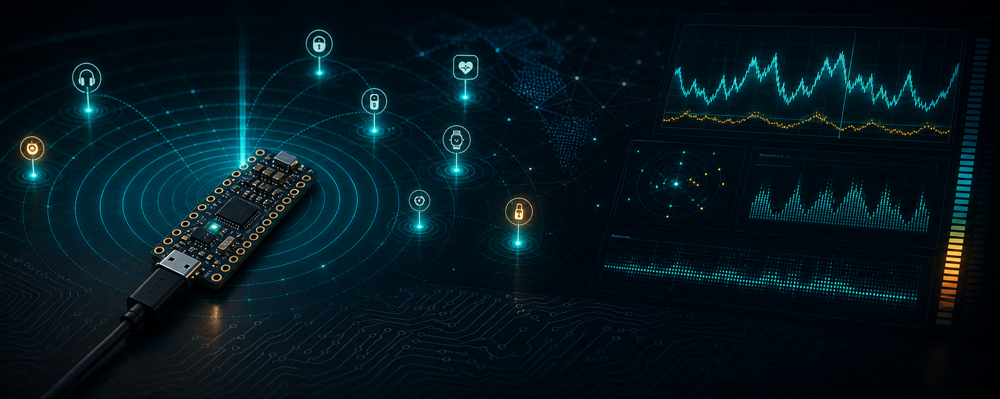

# EchoTrace



[](LICENSE)
[](https://dotnet.microsoft.com/)
[](https://wpfui.lepo.co/)

EchoTrace is a Windows desktop application and nRF52840 firmware for observing nearby BLE advertisements in real time.

The current V1 stack focuses on a practical capture loop:

```text
BLE advertisements -> EchoTrace.Node -> USB CDC JSON Lines -> EchoTrace.App -> SQLite/CSV + live charts
```

It is built for local experimentation, receiver bring-up, RSSI visualization, and capture sessions. The desktop app can also run from a simulator, so UI, charting, storage, and exports can be exercised without hardware attached.

## Current Status

EchoTrace is an early V1 prototype. The core path is usable, but the project is still evolving quickly:

- Firmware target: nice!nano / Pro Micro nRF52840 UF2 boards.
- Desktop target: Windows WPF on .NET 10.
- Input: BLE advertisement events over USB serial JSON Lines.
- UI: WPF UI shell with light/dark themes, live table, RSSI chart, event-rate chart, device detail, ranking, filters, activity log, and settings persistence.
- Storage: SQLite capture sessions and CSV export.

Multi-receiver workflows, replay views, and richer BLE payload analysis are planned but not finished.

## Features

- Real-time BLE advertisement ingestion from a USB CDC receiver.
- Simulator mode for development without hardware.
- Device aggregation by receiver and address.
- Live RSSI time series for the selected device.
- Live events-per-second chart.
- Device table with current RSSI, average RSSI, min/max, seen count, and presence state.
- RSSI ranking panel for quick triage.
- Filters by name/address, minimum RSSI, and present-only mode.
- Capture sessions stored in SQLite.
- CSV export for events and device summaries.
- Light and dark theme support.
- App settings persisted in `%LocalAppData%\EchoTrace\settings.json`.

## Repository Layout

```text
EchoTrace/
  assets/
    brand/               README banner, SVG logo, and brand mark
  src/
    EchoTrace.App/       WPF UI desktop app
    EchoTrace.Core/      Protocol models, parser, simulator, RSSI aggregation
    EchoTrace.Serial/    COM port discovery and async serial reader
    EchoTrace.Storage/   SQLite sessions and CSV export
  tests/
    EchoTrace.Core.Tests/
  firmware/
    EchoTrace.Node/      Zephyr/NCS firmware for nRF52840 UF2 boards
  docs/
    architecture.md
    firmware.md
    protocol.md
```

## Requirements

For the desktop app:

- Windows 10/11.
- .NET 10 SDK.
- A serial-capable nRF52840 receiver, or simulator mode.

For firmware development:

- Nordic Connect SDK installed at `C:\ncs\v3.3.0`.
- Toolchain installed at `C:\ncs\toolchains\936afb6332`.
- CMake and Ninja from the NCS toolchain.
- nice!nano / Pro Micro nRF52840 board with UF2 bootloader.

This repo is configured for the Zephyr board target:

```text
promicro_nrf52840/nrf52840/uf2
```

Do not use Nordic nRF52840 Dongle erase/flash instructions for this board family.

## Quick Start: Desktop App

From the repository root:

```powershell
dotnet build EchoTrace.slnx --no-restore
dotnet test EchoTrace.slnx --no-build
dotnet run --project src\EchoTrace.App\EchoTrace.App.csproj
```

Use `Simulator` mode first to verify the dashboard, filters, charts, theme settings, session storage, and CSV export.

If a receiver is connected, switch to `Serial`, choose the COM port, and connect. EchoTrace selects `COM8` by preference when available, but any detected port can be chosen.

## Firmware Build

The firmware lives in `firmware/EchoTrace.Node`.

The expected UF2 artifact is:

```text
firmware/EchoTrace.Node/build/zephyr/zephyr.uf2
```

Typical `west` build:

```powershell
C:\ncs\toolchains\936afb6332\opt\bin\Scripts\west.exe build -p always -b promicro_nrf52840/nrf52840/uf2 D:\dev\EchoTrace\firmware\EchoTrace.Node -d D:\dev\EchoTrace\firmware\EchoTrace.Node\build
```

If Windows path handling fails because NCS is on `C:` and the repo is on another drive, use the direct CMake/Ninja flow documented in [docs/firmware.md](docs/firmware.md).

## Flashing UF2 Boards

1. Connect the board over USB.
2. Enter the UF2 bootloader by bridging `RST` and `GND` twice quickly.
3. Wait for the UF2 drive to appear.
4. Copy `firmware\EchoTrace.Node\build\zephyr\zephyr.uf2` to that drive.
5. Reconnect or wait for the board to reboot.
6. Open the emitted COM port from EchoTrace.

## Wire Protocol

EchoTrace.Node writes UTF-8 JSON Lines over USB CDC ACM at `115200 8N1`. Each line is one event.

Example advertisement event:

```json
{"v":1,"type":"adv","seq":12,"receiver":"A","uptimeMs":345678,"addr":"AA:BB:CC:DD:EE:FF","addrType":"random","rssi":-67,"name":"Device","advType":"connectable","dataLen":31}
```

The desktop app adds `ReceivedAtUtc` when the line is received.

See [docs/protocol.md](docs/protocol.md) for the field contract.

## Data and Privacy

BLE advertisements can expose device names, device addresses, manufacturer data, and signal-strength patterns. Treat captures as potentially sensitive.

Recommended practices:

- Avoid publishing raw captures from private homes, workplaces, events, or public spaces without review.
- Prefer simulator data in screenshots, examples, and bug reports.
- Redact BLE addresses and names when sharing logs.
- Use EchoTrace for authorized diagnostics, research, and lab work.

## Development Notes

Useful commands from the repository root:

```powershell
dotnet build EchoTrace.slnx --no-restore
dotnet test EchoTrace.slnx --no-build
```

The simulator and serial reader feed the same core pipeline. When changing parsing, aggregation, storage, export, or the wire protocol, update tests and the corresponding docs.

The project uses:

- [CommunityToolkit.Mvvm](https://learn.microsoft.com/dotnet/communitytoolkit/mvvm/)
- [WPF UI](https://wpfui.lepo.co/)
- [ScottPlot](https://scottplot.net/)
- [Microsoft.Data.Sqlite](https://learn.microsoft.com/dotnet/standard/data/sqlite/)
- [Dapper](https://github.com/DapperLib/Dapper)
- Zephyr/Nordic Connect SDK for firmware

## Roadmap

Near-term:

- Move the live dashboard into a dedicated WPF UI page without breaking chart and serial lifetimes.
- Improve Settings with more RSSI/presence thresholds.
- Add session browsing and replay.
- Add richer BLE payload parsing for manufacturer data and service UUIDs.
- Improve CSV export options.

Later:

- Multi-receiver support.
- Receiver health/status panel.
- Comparative RSSI views by receiver.
- Manual 2D receiver map.
- More robust presence classification.

## License

Copyright 2026 EchoTrace contributors.

EchoTrace is licensed under the [Apache License 2.0](LICENSE).
